<p align="center">
  <h3 align="center">Survey on Deep Face Restoration: From Non-blind to Blind and Beyond </h3>
  <p align="center">A comprehensive statistic on methods related to deep face restoration.
    <br />
    <a href="http://export.arxiv.org/pdf/2309.15490">[Paper]</a> &emsp;
    <a href="https://github.com/24wenjie-li/Awesome-Face-Restoration/blob/main/imgs/Supplementary.pdf">[Supplementary Material]</a>
  </p>
</p>

<p align="center">
  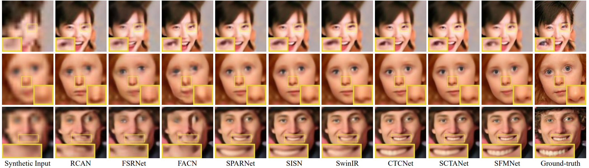
</p>

|[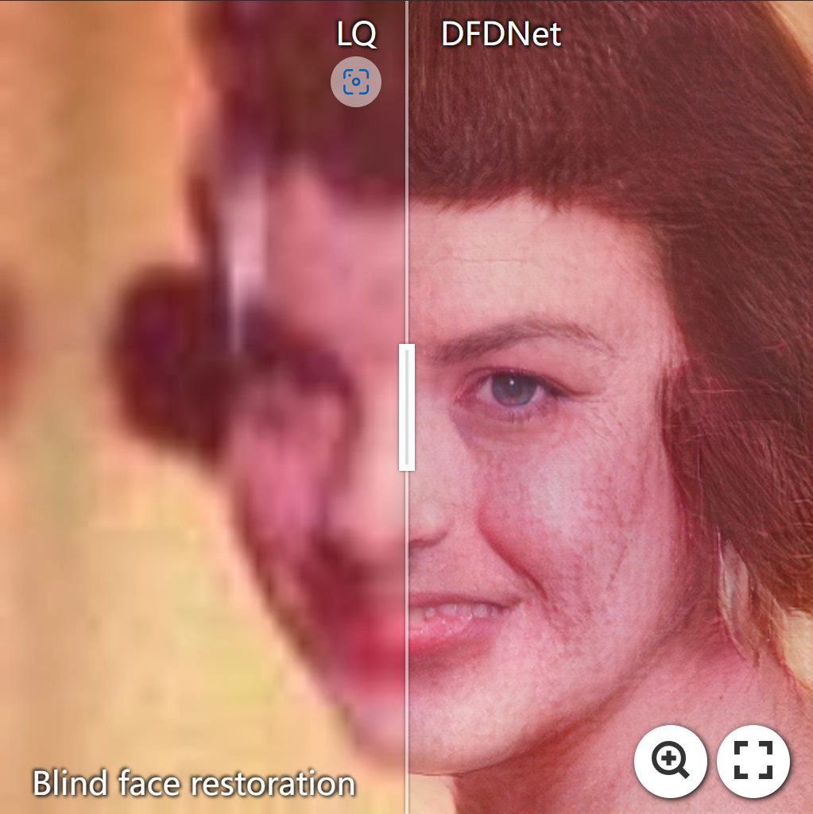](https://imgsli.com/MjEwOTA4) | [](https://imgsli.com/MjEwOTA5) | [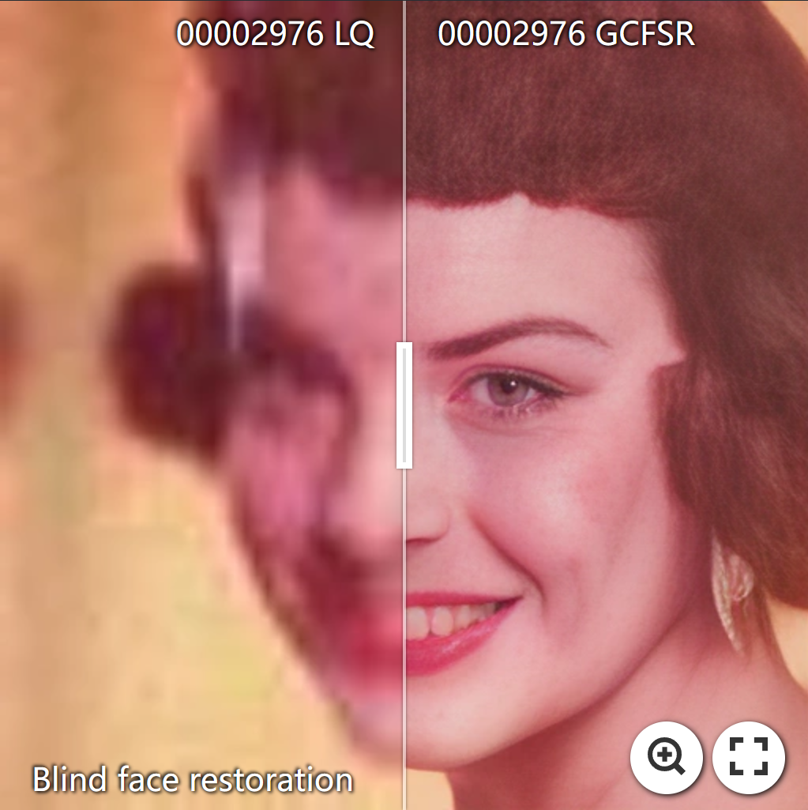](https://imgsli.com/MjEwOTEz) | [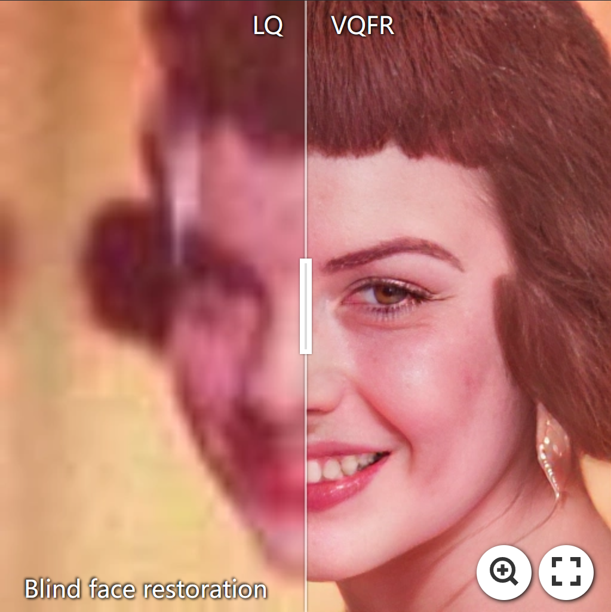](https://imgsli.com/MjEwOTEy) | [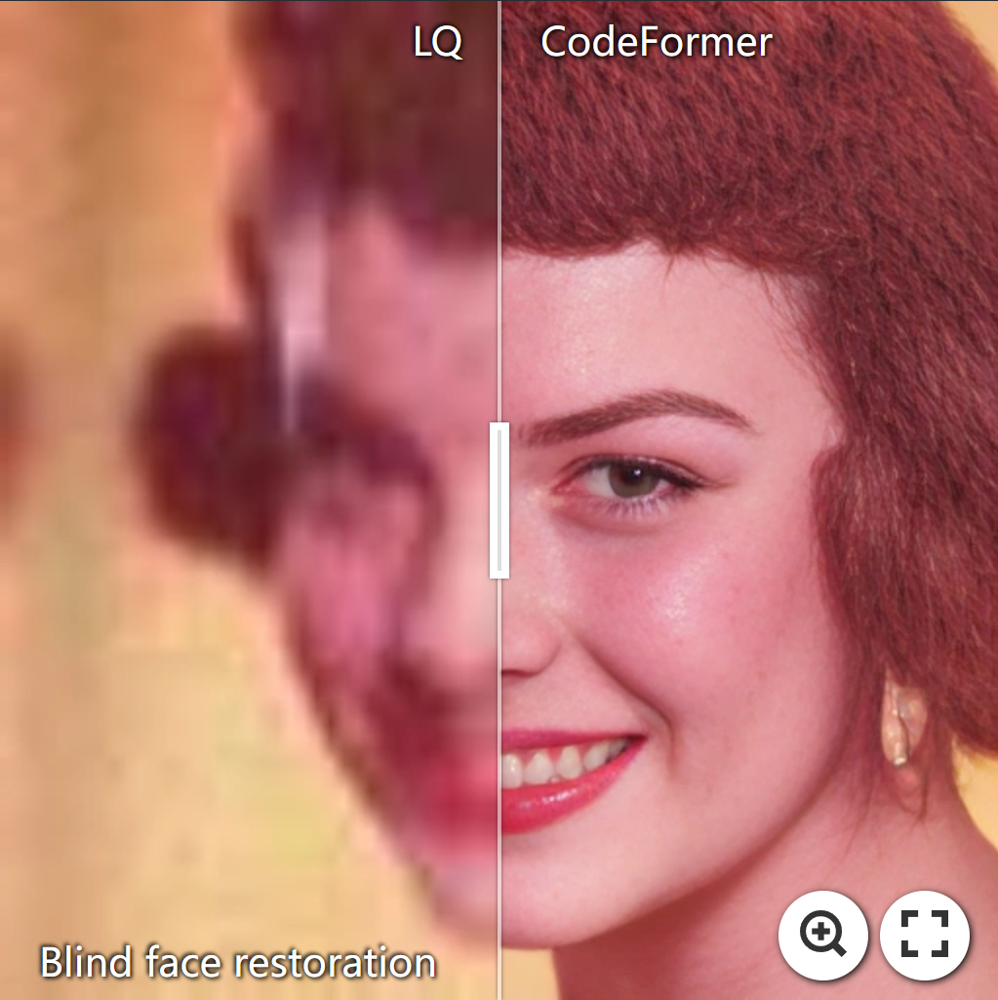](https://imgsli.com/MjEwOTEw)

|[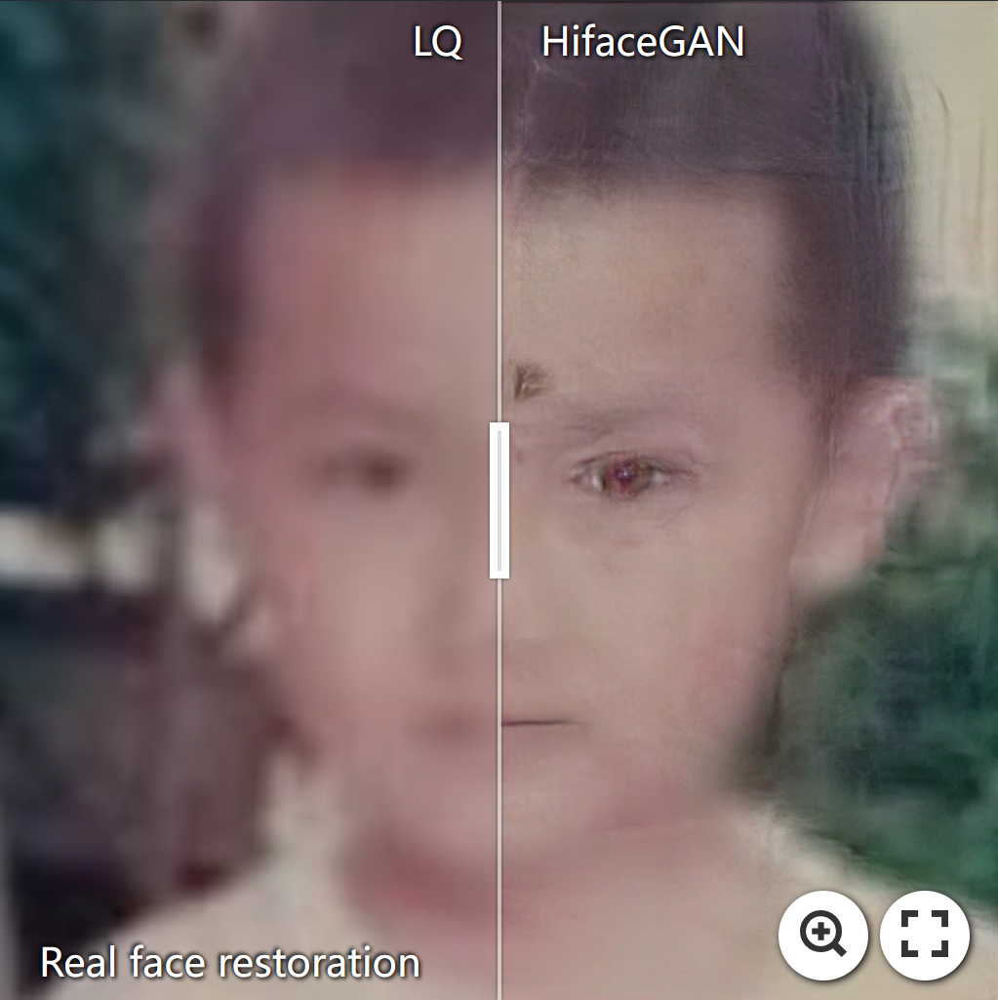](https://imgsli.com/MjEwOTIx) | [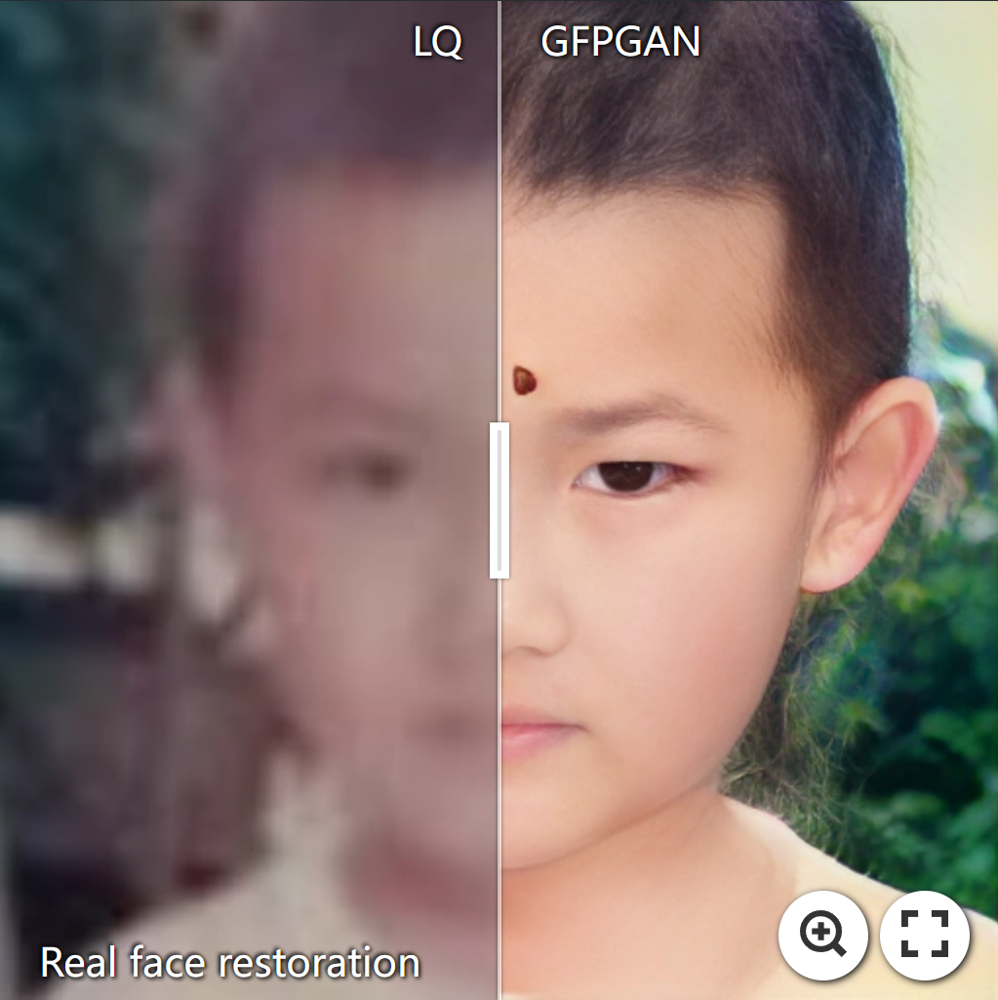](https://imgsli.com/MjEwOTE4) | [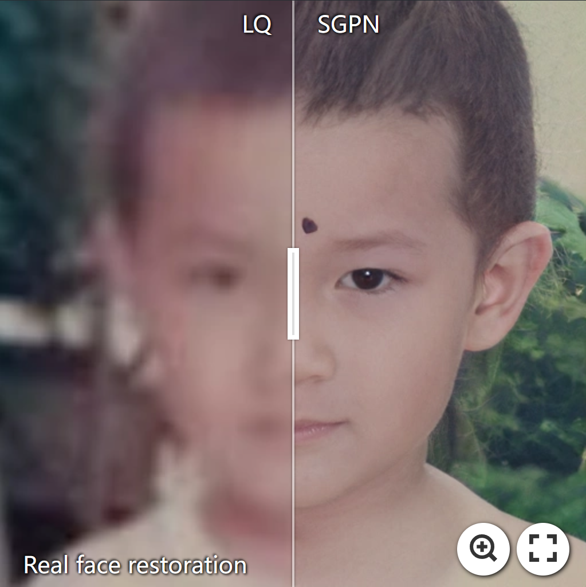](https://imgsli.com/MjEwOTE3) | [](https://imgsli.com/MjEwOTE5) | [](https://imgsli.com/MjEwOTIw)

:boom: **Note**: More visual comparisons can be found in the <a href="http://export.arxiv.org/pdf/2309.15490">Paper</a> and <a href="https://github.com/24wenjie-li/Awesome-Face-Restoration/blob/main/imgs/Supplementary.pdf">Supplementary Material</a>.
  
---

## :clipboard: Citation

```
@article{li2023survey,
  title={Survey on Deep Face Restoration: From Non-blind to Blind and Beyond},
  author={Li, Wenjie and Wang, Mei and Zhang, Kai and Li, Juncheng and Li, Xiaoming and Zhang, Yuhang and Gao, Guangwei and Deng, Weihong and Lin, Chia-Wen},
  journal={arXiv preprint arXiv:2309.15490},
  year={2023}
}
```

## Table of contents
<!-- - [Survey paper](#survey-paper)
- [Table of contents](#table-of-contents) -->
- [Non-Blind Tasks](#non-blind-tasks)
- [Blind Tasks](#blind-tasks)
- [Joint Tasks](#joint-tasks)
  - [Joint Face Completion](#Joint-Face-Completion)
  - [Joint Face Frontalization](#Joint-Face-Frontalization)
  - [Joint Face Alignment](#Joint-Face-Alignment)
  - [Joint Face Recogntion](#Joint-Face-Recogntion)
  - [Joint Face Illumination Compensation](#Joint-Face-Illumination-Compensation)
  - [Joint Face Fairness](#Joint-Face-Fairness)
  - [Joint 3D Face Reconstruction](#Joint-3D-Face-Reconstruction)
- [Perfermance](#perfermance)
  - [Non-Bind Face Super-Resoution](#Non-Blind-Face-Super-Resoution)
  - [Blind Face Restoration](#Blind-Face-Restoration)
  - [Blind Face Super-Resoution](#Blind-Face-Super-Resoution)
  - [Joint Face Restoration](#joint-Face-restoration)
- [Benchmarks](#benchmarks)
  - [Populur Datasets](#Populur-Datasets)
  - [Evaluation Metrics](#Evaluation-Metrics)
 

## Non-Blind Tasks
|Pub<div style="width:60px">|Paper<div style="width:600px">|Technology<div style="width:100px">|
|:---:|:----:|:----:|
|AAAI2015|<a href="https://ojs.aaai.org/index.php/AAAI/article/download/9795/9654">Learning Face Hallucination in the Wild|CNN-based|
|ECCV2016|<a href="https://browse.arxiv.org/pdf/1607.05046v1.pdf">Deep cascaded bi-network for face hallucination|CNN-based|
|ECCV2016|<a href="https://browse.arxiv.org/pdf/1707.00737.pdf">Ultra-resolving face images by discriminative generative networks|GAN-based|
|ICCV2017|<a href="https://openaccess.thecvf.com/content_ICCV_2017/papers/Huang_Wavelet-SRNet_A_Wavelet-Based_ICCV_2017_paper.pdf">Wavelet-SRNet: A Wavelet-based CNN for Multi-scale Face Super Resolution|Wavelet transform|
|CVPR2017|<a href="https://arxiv.org/abs/1708.03132">Attention-Aware Face Hallucination via Deep Reinforcement Learning|Attention-based|
|CVPR2017|<a href="https://ieeexplore.ieee.org/document/8100053">Hallucinating very low-resolution unaligned and noisy face images by transformative discriminative autoencoders|GAN-based|
|IJCAI2017|<a href="https://arxiv.org/pdf/1708.00223.pdf">Learning to Hallucinate Face Images via Component Generation and Enhancement|Prior-based|
|ICASSP2017|<a href="https://ieeexplore.ieee.org/document/8462170">Face Hallucination Based on Key Parts Enhancement|CNN-based|
|CVPR2018|<a href="https://openaccess.thecvf.com/content_cvpr_2018/papers/Chen_FSRNet_End-to-End_Learning_CVPR_2018_paper.pdf">FSRNet: End-to-End Learning Face Super-Resolution with Facial Priors|Prior-based|
|CVPRW2018|<a href="https://arxiv.org/pdf/1811.02328.pdf">Attribute Augmented Convolutional Neural Network for Face Hallucination|GAN-based|
|ECCV2018|<a href="https://arxiv.org/pdf/1811.02328.pdf">Super-Identity Convolutional Neural Network for Face Hallucination|Prior-based|
|ECCV2018|<a href="https://openaccess.thecvf.com/content_ECCV_2018/papers/Xin_Yu_Face_Super-resolution_Guided_ECCV_2018_paper.pdf">Face Super-resolution Guided by Facial Component Heatmaps|Prior-based|
|IJCAI2018|<a href="https://arxiv.org/pdf/1806.10726.pdf">Deep CNN Denoiser and Multi-layer Neighbor Component Embedding for Face Hallucination|CNN-based|
|ICASSP2018|<a href="https://ieeexplore.ieee.org/document/8462170">FACE HALLUCINATION BASED ON KEY PARTS ENHANCEMENT|Prior-based|
|CVPRW2019|<a href="https://arxiv.org/pdf/1806.10726.pdf">Exemplar Guided Face Image Super-Resolution without Facial Landmarks|Prior/GAN-based|
|BMVC2019|<a href="https://arxiv.org/pdf/1908.08239.pdf">Progressive Face Super-Resolution via Attention to Facial Landmark|Prior/GAN-based|
|AAAI2019|<a href="https://ojs.aaai.org/index.php/AAAI/article/view/4937#:~:text=In%20this%20paper%2C%20we%20present%20a%20novel%20deep,a%20multi-block%20cascaded%20structure%20network%20with%20dense%20connection.">Residual Attribute Attention Network for Face Image Super-Resolution|Attention-based|
|TMM2019|<a href="https://ieeexplore.ieee.org/document/8936424">ATMFN: Adaptive-threshold-based Multi-model Fusion Network for Compressed Face Hallucination|CNN/GAN/RNN-based|
|IJCV2019|<a href="https://arxiv.org/pdf/1811.09019.pdf">Joint Face Hallucination and Deblurring via Structure Generation and Detail Enhancement|Prior-based|
|PR2019|<a href="https://www.sciencedirect.com/science/article/abs/pii/S003132031930202X">Face hallucination from low quality images using definition-scalable inference|Frequency-based|
|TIP2020|<a href="https://browse.arxiv.org/pdf/2012.01211.pdf">Learning Spatial Attention for Face Super-Resolution|Attention-based|
|TIP2020|<a href="https://ieeexplore.ieee.org/document/9082831/metrics#metrics">Deblurring Face Images using Uncertainty Guided Multi-Stream Semantic Networks|Prior-based|
|TMM2020|<a href="https://ieeexplore.ieee.org/document/9055090">Learning Face Image Super-Resolution through Facial Semantic Attribute Transformation and Self-Attentive Structure Enhancement|Prior-based|
|TNNLS2020|<a href="https://ieeexplore.ieee.org/document/9229100">Dual-Path Deep Fusion Network for Face Image Hallucination|CNN-based|
|ECCV2020|<a href="https://browse.arxiv.org/pdf/2007.09454.pdf">Face Super-Resolution Guided by 3D Facial Priors|Prior-based|
|CVPR2020|<a href="https://arxiv.org/abs/2003.13063">Deep Face Super-Resolution with Iterative Collaboration between Attentive Recovery and Landmark Estimation|Prior-based|
|CVPR2020|<a href="https://openaccess.thecvf.com/content_CVPR_2020/papers/Karnewar_MSG-GAN_Multi-Scale_Gradients_for_Generative_Adversarial_Networks_CVPR_2020_paper.pdf">MSG-GAN: Multi-Scale Gradients for Generative Adversarial Networks|GAN-based|
|AAAI2020|<a href="https://browse.arxiv.org/pdf/2002.06518.pdf">Facial Attribute Capsules for Noise Face Super Resolution|Prior-based|
|MM2020|<a href="https://arxiv.org/abs/2005.00306">PCA-SRGAN: Incremental Orthogonal Projection Discrimination for Face Super-resolution|GAN-based|
|ICASSP2020|<a href="https://ieeexplore.ieee.org/document/9053398">PARSING MAP GUIDED MULTI-SCALE ATTENTION NETWORK FOR FACE HALLUCINATION|Prior-based|
|WACV2020|<a href="https://ieeexplore.ieee.org/document/9093399">Component Attention Guided Face Super-Resolution Network: CAGFace|Prior-based|
|FG2020|<a href="https://ieeexplore.ieee.org/abstract/document/9320151">ATFaceGAN: Single Face Image Restoration and Recognition from Atmospheric Turbulence|GAN-based|
|TBIOM2021|<a href="https://ieeexplore.ieee.org/document/9321495">Semantic-Driven Face Hallucination Based on Residual Network|Prior-based|
|TBBLS2021|<a href="https://ieeexplore.ieee.org/document/9353687">E-ComSupResNet: Enhanced Face Super-Resolution Through Compact Network|CNN-based|
|TCYB2021|<a href="https://ieeexplore.ieee.org/document/8617685">Sequential Gating Ensemble Network for Noise Robust Multiscale Face Restoration|CNN-based|
|TIP2021|<a href="https://ieeexplore.ieee.org/document/9395386">Features Guided Face Super-Resolution via Hybrid Model of Deep Learning and Random Forests|Prior-based|
|TPAMI2021|<a href="https://ieeexplore.ieee.org/document/9591403">Face restoration via plug-and-play 3d facial priors|Prior-based|
|CVPR2021|<a href="https://browse.arxiv.org/pdf/2012.00739.pdf">GLEAN: Generative Latent Bank for Large-Factor Image Super-Resolutio|GAN/Prior-based|
|MM2021|<a href="https://arxiv.org/abs/2010.11575">Face Hallucination via Split-Attention in Split-Attention Network|Attention-based|
|ICME2021|<a href="https://ieeexplore.ieee.org/abstract/document/9428256">HEATMAP-AWARE PYRAMID FACE HALLUCINATION|Prior-based|
|ICME2021|<a href="https://ieeexplore.ieee.org/document/9102926">SAAN: SEMANTIC ATTENTION ADAPTATION NETWORK FOR FACE SUPER-RESOLUTION|Prior-based|
|ICME2021|<a href="https://ieeexplore.ieee.org/abstract/document/9428152">ORGAN-BRANCHED CNN FOR ROBUST FACE SUPER-RESOLUTION|GAN/Prior-based|
|ICME2021|<a href="https://ieeexplore.ieee.org/abstract/document/9428360">FACE SUPER-RESOLUTION THROUGH DUAL-IDENTITY CONSTRAINT|Prior-based|
|ICIP2021|<a href="https://ieeexplore.ieee.org/abstract/document/9506610">Progressive Face Super-Resolution with Non-Parametric Facial Prior Enhancement|Prior-based|
|TCSVT2022|<a href="https://ieeexplore.ieee.org/document/9964277">Progressive Face Super-Resolution with Non-Parametric Facial Prior Enhancement|Attention-based|
|TCSVT2022|<a href="https://ieeexplore.ieee.org/abstract/document/9792407">Propagating Facial Prior Knowledge for Multitask Learning in Face Super-Resolution|Prior-based|
|TIP2022|<a href="https://ieeexplore.ieee.org/document/9916123">Attention-Driven Graph Neural Network for Deep Face Super-Resolution|Attention-based|
|TPAMI2022|<a href="https://ieeexplore.ieee.org/document/9887996">Image Super-Resolution via Iterative Refinement|Diffusion-based|
|Nercom2022|<a href="https://browse.arxiv.org/pdf/2104.14951.pdf">SRDiff: Single Image Super-Resolution with Diffusion Probabilistic Models|Diffusion-based|
|ICME2022|<a href="https://ieeexplore.ieee.org/document/9859616">RCNet: Recurrent Collaboration Network Guided by Facial Priors for Face Super-Resolution|Prior-based|
|IJCB2022|<a href="https://browse.arxiv.org/pdf/2210.06002.pdf">Face Super-Resolution with Progressive Embedding of Multi-scale Face Priors|Prior-based|
|ICME2022|<a href="https://ieeexplore.ieee.org/document/9859616">RCNet: Recurrent Collaboration Network Guided by Facial Priors for Face Super-Resolution|Prior-based|
|Arxiv2022|<a href="https://browse.arxiv.org/pdf/2212.07352.pdf">Bi-Noising Diffusion: Towards Conditional Diffusion Models with Generative Restoration Priors|Diffusion-based|
|Arxiv2022|<a href="https://browse.arxiv.org/pdf/2207.07945.pdf">Stochastic Attribute Modeling for Face Super-Resolution|Prior-based|
|Arxiv2022|<a href="https://browse.arxiv.org/pdf/2209.10167.pdf">HAZE-Net: High-Frequency Attentive Super-Resolved Gaze Estimation in Low-Resolution Face Images|Frequency-based|
|TMM2023|<a href="https://ieeexplore.ieee.org/document/10145603">An Efficient Latent Style Guided Transformer-CNN Framework for Face Super-Resolution|Attention-based|
|TMM2023|<a href="https://ieeexplore.ieee.org/document/10145603">SCTANet: A Spatial Attention-Guided CNN-Transformer Aggregation Network for Deep Face Image Super-Resolution|Attention-based|
|TMM2023|<a href="https://ieeexplore.ieee.org/stamp/stamp.jsp?tp=&arnumber=10207832">Exploiting Multi-scale Parallel Self-attention and Local Variation via Dual-branch Transformer-CNN Structure for Face Super-resolution|Attention-based|
|TBIOM2023|<a href="https://browse.arxiv.org/pdf/2304.02923.pdf">Super-Resolving Face Image by Facial Parsing Information|Prior-based|
|TIP2023|<a href="https://ieeexplore.ieee.org/document/10087319">CTCNet: A CNN-Transformer Cooperation Network for Face Image Super-Resolution|Attention-based|
|TIM2023|<a href="https://ieeexplore.ieee.org/document/10044127">Deep HyFeat Based Attention in Attention Model for Face Super-Resolution|GAN/Attention-based|
|PR2023|<a href="https://www.sciencedirect.com/science/article/abs/pii/S0031320323002030">A Composite Network Model for Face Super-Resolution with Multi-Order Head Attention Facial Priors|Attention/Prior-based|
|CVPR2023|<a href="https://openaccess.thecvf.com/content/CVPR2023/papers/Wang_Spatial-Frequency_Mutual_Learning_for_Face_Super-Resolution_CVPR_2023_paper.pdf">Spatial-Frequency Mutual Learning for Face Super-Resolution|Attention-based|
|CVPR2023|<a href="https://browse.arxiv.org/pdf/2303.16491.pdf">Implicit Diffusion Models for Continuous Super-Resolution|Diffusion-based|
|IJCAI2023|<a href="https://www.ijcai.org/proceedings/2023/0115.pdf">Learning Attention from Attention: Effcient Self-Refnement Transformer for Face Super-Resolution|Attention-based|
|AAAI2024|<a href="https://ojs.aaai.org/index.php/AAAI/article/view/28195">SkipDiff: Adaptive Skip Diffusion Model for High-Fidelity Perceptual Image Super-resolution|Diffusion-based|
|TBOIM2024|<a href="https://ieeexplore.ieee.org/document/10485196">SPADNet: Structure Prior-aware Dynamic Network for Face Super-Resolution|Prior-based|
|TNNLS2024|<a href="https://ieeexplore.ieee.org/document/9875217">Rethinking Prior-Guided Face Super-Resolution: A New Paradigm With Facial Component Prior|Prior-based|
|TCSVT2024|<a href="https://ieeexplore.ieee.org/stamp/stamp.jsp?tp=&arnumber=10535972">PLGNet: Prior-guided Local and Global Interactive Hybrid Network for Face Super-Resolution|Prior-based|

## Blind Tasks
|Pub<div style="width:60px">|Paper<div style="width:600px">|Technology<div style="width:100px">|
|:---:|:----:|:----:|
|CVPRW2017|<a href="https://browse.arxiv.org/pdf/1704.08772.pdf">Deep Face Deblurring|CNN-based|
|ECCV2018|<a href="https://vcg.seas.harvard.edu/publications/learning-to-super-resolve-blurry-face-and-text-images/paper">Learning to Super-Resolve Blurry Face and Text Images|GAN-based|
|ECCV2018|<a href="https://openaccess.thecvf.com/content_ECCV_2018/papers/Xiaoming_Li_Learning_Warped_Guidance_ECCV_2018_paper.pdf">Learning Warped Guidance for Blind Face Restoration|CNN-based|
|ECCV2018|<a href="https://arxiv.org/abs/1705.09966">Attribute-guided face generation using conditional cyclegan|CycleGAN-based|
|ECCV2018|<a href="https://openaccess.thecvf.com/content_ECCV_2018/papers/Adrian_Bulat_To_learn_image_ECCV_2018_paper.pdf">To learn image super-resolution, use a GAN to learn how to do image degradation first|CycleGAN-based|
|CVPR2018|<a href="https://browse.arxiv.org/pdf/1712.02765.pdf">Super-fan: Integrated facial landmark localization and super-resolution of real-world low resolution faces in arbitrary poses with gans|Prior/GAN-based|
|CVPR2018|<a href="https://arxiv.org/abs/1803.03345">Exploiting Semantics for Face Image Deblurring|Prior-based|
|CVPRW2018|<a href="https://ieeexplore.ieee.org/document/8575269">Learning Face Deblurring Fast and Wide|Prior-based|
|ICCV2019|<a href="https://ieeexplore.ieee.org/document/9008540">DeblurGAN-v2: Deblurring (Orders-of-Magnitude) Faster and Better|GAN-based|
|ICIP2019|<a href="https://ieeexplore.ieee.org/document/8803393">GUIDED CYCLEGAN VIA SEMI-DUAL OPTIMAL TRANSPORT FOR PHOTO-REALISTIC FACE SUPER-RESOLUTION|CycleGAN-based|
|IJCV2020|<a href="https://arxiv.org/abs/2001.06822v2">Exploiting Semantics for Face Image Deblurring|Prior-based|
|IJCV2020|<a href="https://browse.arxiv.org/pdf/1904.04241.pdf">Identity-preserving Face Recovery from Stylized Portraits|Prior-based|
|AAAI2020|<a href="https://ojs.aaai.org/index.php/AAAI/article/view/6818">Learning to Deblur Face Images via Sketch Synthesis|GAN-based|
|ECCV2020|<a href="https://Arxiv.org/pdf/2008.00418">Blind Face Restoration via Deep Multi-scale Component Dictionaries|GAN/Prior-based|
|CVPR2020|<a href="https://openaccess.thecvf.com/content_CVPR_2020/papers/Li_Enhanced_Blind_Face_Restoration_With_Multi-Exemplar_Images_and_Adaptive_Spatial_CVPR_2020_paper.pdf">Enhanced Blind Face Restoration with Multi-Exemplar Images and Adaptive Spatial Feature Fusion|GAN/Prior-based|
|CVPR2020|<a href="https://openaccess.thecvf.com/content_CVPR_2020/papers/Gu_Image_Processing_Using_Multi-Code_GAN_Prior_CVPR_2020_paper.pdf">Image Processing Using Multi-Code GAN Prior|GAN/Prior-based|
|MM2020|<a href="https://github.com/Lotayou/Face-Renovation">HiFaceGAN: Face Renovation via Collaborative Suppression and Replenishment|GAN-based|
|Arxiv2020|<a href="https://arxiv.org/abs/1711.09515">DeepDeblur: Fast one-step blurry face images restoration|GAN-based|
|CVPR2021|<a href="https://openaccess.thecvf.com/content/CVPR2021/papers/Chen_Progressive_Semantic-Aware_Style_Transformation_for_Blind_Face_Restoration_CVPR_2021_paper.pdf">Progressive Semantic-Aware Style Transformation for Blind Face Restoration|GAN-based|
|CVPR2021|<a href="https://openaccess.thecvf.com/content/CVPR2021/papers/Chen_Progressive_Semantic-Aware_Style_Transformation_for_Blind_Face_Restoration_CVPR_2021_paper.pdf">Progressive Semantic-Aware Style Transformation for Blind Face Restoration|GAN-based|
|CVPR2021|<a href="https://openaccess.thecvf.com/content/CVPR2021/papers/Chen_Progressive_Semantic-Aware_Style_Transformation_for_Blind_Face_Restoration_CVPR_2021_paper.pdf">Progressive Semantic-Aware Style Transformation for Blind Face Restoration|GAN/Prior-based|
|CVPR2021|<a href="https://openaccess.thecvf.com/content/CVPR2021/papers/Wang_Towards_Real-World_Blind_Face_Restoration_With_Generative_Facial_Prior_CVPR_2021_paper.pdf">Towards Real-World Blind Face Restoration with Generative Facial Prior|GAN/Prior-based|
|CVPR2021|<a href="https://openaccess.thecvf.com/content/CVPR2021/papers/Yang_GAN_Prior_Embedded_Network_for_Blind_Face_Restoration_in_the_CVPR_2021_paper.pdf">GAN Prior Embedded Network for Blind Face Restoration in the Wild|GAN/Prior-based|
|Arxiv2021|<a href="https://arxiv.org/abs/2110.01033">Universal Face Restoration With Memorized Modulation|GAN-based|
|Arxiv2021|<a href="https://arxiv.org/abs/2010.05508">Implicit Subspace Prior Learning for Dual-Blind Face Restoration|GAN-based|
|CVPR2022|<a href="https://Arxiv.org/pdf/2201.06374.pdf">RestoreFormer: High-Quality Blind Face Restoration <br> from Undegraded Key-Value Pairs|GAN/Attention/Prior-based|
|CVPR2022|<a href="https://openaccess.thecvf.com/content/CVPR2022/papers/Zhu_Blind_Face_Restoration_via_Integrating_Face_Shape_and_Generative_Priors_CVPR_2022_paper.pdf">Blind Face Restoration via Integrating Face Shape and Generative Priors|GAN/Prior-based|
|CVPR2022|<a href="https://openaccess.thecvf.com/content/CVPR2022/html/Zhao_Rethinking_Deep_Face_Restoration_CVPR_2022_paper.html">Rethinking Deep Face Restoration|GAN/Prior-based|
|CVPR2022|<a href="https://openaccess.thecvf.com/content/CVPR2022/papers/He_GCFSR_A_Generative_and_Controllable_Face_Super_Resolution_Method_Without_CVPR_2022_paper.pdf">GCFSR: a Generative and Controllable Face Super Resolution Method Without Facial and GAN Priors|GAN-based|
|CVPRW2022|<a href="https://openaccess.thecvf.com/content/CVPR2022W/NTIRE/papers/Dong_Unpaired_Face_Restoration_via_Learnable_Cross-Quality_Shift_CVPRW_2022_paper.pdf">Unpaired Face Restoration via Learnable Cross-Quality Shift|CycleGAN-based|
|AAAI2022|<a href="https://arxiv.org/pdf/2203.08444.pdf">Panini-Net: GAN Prior Based Degradation-Aware Feature Interpolation for Face Restoration|GAN/Prior-based|
|ECCV2022|<a href="https://Arxiv.org/pdf/2205.06803.pdf">VQFR: Blind Face Restoration with Vector-Quantized Dictionary and Parallel Decoder|GAN/Prior-based|
|ECCV2022|<a href="https://arxiv.org/pdf/2210.00752v2.pdf">From Face to Natural Image: Learning Real Degradation for Blind Image Super-Resolution|GAN-based|
|Nips2022|<a href="https://Arxiv.org/pdf/2206.11253.pdf">Towards Robust Blind Face Restoration with Codebook Lookup Transformer|GAN/Prior-based|
|ICME2022|<a href="https://ieeexplore.ieee.org/document/9859870">FEATURE-GUIDED BLIND FACE RESTORATION WITH GAN PRIOR|GAN/Prior-based|
|WACV2022|<a href="https://ieeexplore.ieee.org/document/9707072">Deep Feature Prior Guided Face Deblurring|GAN/Prior-based|
|TCSVT2022|<a href="https://ieeexplore.ieee.org/document/10044117">DEAR-GAN: Degradation-Aware Face Restoration with GAN Prior|GAN/Prior-based|
|TPAMI2022|<a href="https://ieeexplore.ieee.org/abstract/document/9808408">GLEAN: Generative Latent Bank for Image Super-Resolution and Beyond|GAN/Prior-based|
|TPAMI2022|<a href="https://arxiv.org/pdf/2210.08160.pdf">Learning Dual Memory Dictionaries for Blind Face Restoration|GAN/Prior-based|
|SIGGRAPH2022|<a href="https://www.wslai.net/publications/fusion_deblur/">Face Deblurring using Dual Camera Fusion on Mobile Phones|CNN-based|
|Arxiv2022|<a href="https://arxiv.org/abs/2207.09790">FaceFormer: Scale-aware Blind Face Restoration with Transformers|GAN/Attention-based|
|Arxiv2022|<a href="https://Arxiv.org/pdf/2206.13962.pdf">Multi-prior learning via neural architecture search for blind face restoration|GAN/Prior-based|
|Arxiv2022|<a href="https://Arxiv.org/pdf/2206.03697.pdf">Blind Face Restoration: Benchmark Datasets and a Baseline Model|GAN/Attention-based|
|Arxiv2022|<a href="https://browse.arxiv.org/pdf/2205.14377v1.pdf">Enhancing Quality of Pose-varied Face Restoration with Local Weak Feature Sensing and GAN Prior|GAN/Prior-based|
|Arxiv2022|<a href="https://arxiv.org/pdf/2212.06512.pdf">Difface: Blind Face Restoration with Diffused Error Contraction|Diffusion-based|
|Arxiv2022|<a href="Face Deblurring Based on Separable Normalization and Adaptive Denormalization">Face Deblurring Based on Separable Normalization and Adaptive Denormalization|Prior/GAN-based|
|CVPR2023|<a href="https://arxiv.org/abs/2303.06885">DR2: Diffusion-based Robust Degradation Remover for Blind Face Restoration|Diffusion-based|
|CVPRW2023|<a href="https://openaccess.thecvf.com/content/CVPR2023W/MULA/papers/Xie_TFRGAN_Leveraging_Text_Information_for_Blind_Face_Restoration_With_Extreme_CVPRW_2023_paper.pdf">TFRGAN: Leveraging Text Information for Blind Face Restoration with Extreme Degradation|GAN/Prior-based|
|CVPRW2023|<a href="https://ieeexplore.ieee.org/stamp/stamp.jsp?tp=&arnumber=10208556">FRR-Net: A Real-Time Blind Face Restoration and Relighting Network|GAN/Prior-based|
|AAAI2023|<a href="https://arxiv.org/abs/2211.13524">GAN Prior Based Null-Space Learning for Consistent Super-resolution|GAN-based|
|IJCAI2023|<a href="https://www.ijcai.org/proceedings/2023/128">Analyzing and Combating Attribute Bias for Face Restoration|GAN/Prior-based|
|ICML2023|<a href="https://arxiv.org/abs/2212.00490">ZERO-SHOT IMAGE RESTORATION USING DENOISING DIFFUSION NULL-SPACE MODEL|Diffusion-based|
|ICCV2023|<a href="https://arxiv.org/abs/2307.08996">Towards Authentic Face Restoration with Iterative Diffusion Models and Beyond|Diffusion-based|
|ICCV2023|<a href="https://openaccess.thecvf.com/content/ICCV2023/papers/Yin_MetaF2N_Blind_Image_Super-Resolution_by_Learning_Efficient_Model_Adaptation_from_ICCV_2023_paper.pdf">MetaF2N: Blind Image Super-Resolution by Learning Efficient Model Adaptation from Faces|Prior-based|
|MM2023|<a href="https://arxiv.org/abs/2305.04517">DiffBFR: Bootstrapping Diffusion Model Towards Blind Face Restoration|Diffusion-based|
|MM2023|<a href="https://dl.acm.org/doi/pdf/10.1145/3581783.3611782">Exploring Correlations in Degraded Spatial Identity Features for Blind Face Restoration|GAN/Prior-based|
|Nips2023|<a href="https://browse.arxiv.org/pdf/2309.10810.pdf">PGDiff: Guiding Diffusion Models for Versatile Face Restoration via Partial Guidance|Diffusion-based|
|TIP2023|<a href="https://ieeexplore.ieee.org/document/10036448">Semi-Cycled Generative Adversarial Networks for Real-World Face Super-Resolution>|CycleGAN-based|
|TPAMI2023|<a href="https://ieeexplore.ieee.org/document/9744329">Old Photo Restoration via Deep Latent Space Translation|GAN/Prior-based|
|TPAMI2023|<a href="https://ieeexplore.ieee.org/document/9730053">Multi-Modality Deep Restoration of Extremely Compressed Face Videos|GAN/Prior-based|
|TPAMI2023|<a href="https://browse.arxiv.org/pdf/2308.07228.pdf">RestoreFormer++: Towards Real-World Blind Face Restoration from Undegraded Key-Value Pairs|Prior/GAN-based|
|TCSVT2023|<a href="https://browse.arxiv.org/pdf/2308.10196.pdf">Blind Face Restoration for Under-Display Camera via Dictionary Guided Transformer|Prior/Attention-based|
|WACV2023|<a href="https://openaccess.thecvf.com/content/WACV2023/papers/Nair_ATDDPM_Restoring_Faces_Degraded_by_Atmospheric_Turbulence_Using_Denoising_Diffusion_WACV_2023_paper.pdf">AT-DDPM: Restoring Faces degraded by Atmospheric Turbulence using Denoising Diffusion Probabilistic Models|Diffusion-based|
|Arxiv2023|<a href="https://browse.arxiv.org/pdf/2308.15070.pdf">DiffBIR: Towards Blind Image Restoration with Generative Diffusion Prior|Diffusion-based|
|Arxiv2023|<a href="https://browse.arxiv.org/pdf/2305.07015.pdf">Exploiting Diffusion Prior for Real-World Image Super-Resolution|Diffusion-based|
|Arxiv2023|<a href="https://browse.arxiv.org/pdf/2309.07495.pdf">HDTR-Net: A Real-Time High-Definition Teeth Restoration Network for Arbitrary Talking Face Generation Methods|CNN-based|
|Arxiv2023|<a href="https://arxiv.org/pdf/2312.15736.pdf">Towards Real-World Blind Face Restoration with Generative Diffusion Prior|Prior/Diffusion-based|
|ICLR2024|<a href="https://browse.arxiv.org/pdf/2308.07314.pdf">DUAL ASSOCIATED ENCODER FOR FACE RESTORATION|Prior/GAN-based|
|AAAI2024|<a href="https://ojs.aaai.org/index.php/AAAI/article/view/27889">Blind Face Restoration under Extreme Conditions: Leveraging 3D-2D Prior Fusion for Superior Structural and Texture Recovery|Prior/GAN-based|
|AAAI2024|<a href="https://browse.arxiv.org/pdf/2303.08714.pdf">ResDiff: Combining CNN and Diffusion Model for Image Super-Resolution|Diffusion-based|
|CVPR2024|<a href="https://arxiv.org/pdf/2403.12760.pdf">WaveFace: Authentic Face Restoration with Efficient Frequency Recovery|Diffusion-based|
|CVPR2024|<a href="https://arxiv.org/pdf/2403.08436.pdf">PFStorer: Personalized Face Restoration and Super-Resolution|Diffusion-based|
|Arxiv2024|<a href="https://arxiv.org/pdf/2403.10098.pdf">DiffMAC: Diffusion Manifold Hallucination Correction for High Generalization Blind Face Restoration|Diffusion-based|
|NTIRE2024|<a href="https://arxiv.org/pdf/2404.19500">Towards Real-world Video Face Restoration: A New Benchmark|Benchmark|


## Joint Tasks
### Joint Face Completion
|Pub<div style="width:60px">|Paper<div style="width:600px">|Technology<div style="width:100px">|
|:---:|:----:|:----:|
|ICME2019|<a href="https://ieeexplore.ieee.org/document/8784896">Facial Image Inpainting Using Multi-level Generative Network|CNN-based|
|FG2020|<a href="https://ieeexplore.ieee.org/abstract/document/9320168">IF-GAN: Generative Adversarial Network for Identity Preserving Facial Image Inpainting and Frontalization|GAN-based|
|TBOIM2020|<a href="https://ieeexplore.ieee.org/document/8890717">FCSR-GAN: Joint Face Completion and Super-Resolution via Multi-Task Learning|GAN/Prior-based|
|TCSVT2020|<a href="https://ieeexplore.ieee.org/document/8963643">Occluded Face Recognition in the Wild by Identity-Diversity Inpainting|GAN/Prior-based|
|ICIP2022|<a href="https://ieeexplore.ieee.org/document/9956183">Swin-CasUNet: Cascaded U-Net with Swin Transformer for Masked Face Restoration|Attention-based|
|WACV2022|<a href="https://arxiv.org/abs/2110.10395">3DFaceFill: An Analysis-By-Synthesis Approach to Face Completion|Prior/GAN-based|
|TMM2022|<a href="https://ieeexplore.ieee.org/abstract/document/9991050">Pluralistic Face Inpainting with Transformation of Attribute Information|GAN/Prior-based|
|TMM2023|<a href="https://ieeexplore.ieee.org/abstract/document/9695189">FT-TDR: Frequency-Guided Transformer and Top-Down Refinement Network for Blind Face Inpainting|GAN/Prior-based|
|TMM2023|<a href="https://ieeexplore.ieee.org/document/10032643">JDSR-GAN: Constructing an Efficient Joint Learning Network for Masked Face Super-Resolution|GAN/Prior-based|
|TCSVT2022|<a href="https://ieeexplore.ieee.org/document/9625034">SwapInpaint: Identity-Specific Face Inpainting With Identity Swapping|GAN/Prior-based|
|JVCI2023|<a href="https://browse.arxiv.org/pdf/2003.00255.pdf">Joint Face Completion and Super-resolution using Multi-scale Feature Relation Learning|GAN/Prior-based|
|ICASSP2023|<a href="https://ieeexplore.ieee.org/document/10097082">Fine-Grained Blind Face Inpainting with 3D Face Component Disentanglement|Prior-based|
|TIP2023|<a href="https://ieeexplore.ieee.org/document/10036452">Deep Face Video Inpainting via UV Mapping|Attention/GAN/Prior-based|
|PR2023|<a href="https://www.sciencedirect.com/science/article/pii/S1047320323000561">Joint face completion and super-resolution using multi-scale feature relation learning|Attention/GAN/Prior-based|


### Joint Face Frontalization
|Pub<div style="width:60px">|Paper<div style="width:600px">|Technology<div style="width:100px">|
|:---:|:----:|:----:|
|TPAMI2019|<a href="https://ieeexplore.ieee.org/document/8704962">Can We See More? Joint Frontalization and Hallucination of Unaligned Tiny Faces|GAN-based|
|FG2020|<a href="https://ieeexplore.ieee.org/abstract/document/9320168">IF-GAN: Generative Adversarial Network for Identity Preserving Facial Image Inpainting and Frontalization|GAN-based|
|TCSVT2021|<a href="https://ieeexplore.ieee.org/document/9427073">Joint Face Image Restoration and Frontalization for Recognition|GAN/Prior-based|
|TCSVT2021|<a href="https://ieeexplore.ieee.org/document/9535188">Simultaneous Face Completion and Frontalization via Mask Guided Two-Stage GAN|GAN/Attention-based|
|TIP2021|<a href="https://ieeexplore.ieee.org/document/9318504">Face Hallucination With Finishing Touches|GAN/Prior-based|


### Joint Face Alignment
|Pub<div style="width:60px">|Paper<div style="width:600px">|Technology<div style="width:100px">|
|:---:|:----:|:----:|
|AAAI2017|<a href="https://ojs.aaai.org/index.php/AAAI/article/view/11206">Face Hallucination with Tiny Unaligned Images by Transformative Discriminative Neural Networks|GAN-based|
|CVPR2017|<a href="https://ieeexplore.ieee.org/document/8100053">Hallucinating Very Low-Resolution Unaligned and Noisy Face Images by Transformative Discriminative Autoencoders∗|GAN-based|
|CVPR2018|<a href="https://ieeexplore.ieee.org/abstract/document/8713923">Semantic Face Hallucination: Super-Resolving Very Low-Resolution Face Images with Supplementary Attributes|GAN-based|
|AAAI2020|<a href="https://arxiv.org/abs/1911.08566v1">Joint Super-Resolution and Alignment of Tiny Faces|Prior-based|
|IJCV2020|<a href="https://link.springer.com/article/10.1007/s11263-019-01254-5">Hallucinating Unaligned Face Images by Multiscale Transformative Discriminative Networks|GAN-based|


### Joint Face Recogntion
|Pub<div style="width:60px">|Paper<div style="width:600px">|Technology<div style="width:100px">|
|:---:|:----:|:----:|
|ECCV2018|<a href="https://arxiv.org/pdf/1811.02328.pdf">Super-Identity Convolutional Neural Network for Face Hallucination|Prior-based|
|ICIP2019|<a href="https://ieeexplore.ieee.org/document/8803782">Low-Resolution Face Recognition Based on Identity-Preserved Face Hallucination|CNN-based|
|TIP2019|<a href="https://ieeexplore.ieee.org/document/8751141">SiGAN: Siamese Generative Adversarial Network for Identity-Preserving Face Hallucination|GAN/Prior-based|
|TIP2019|<a href="https://ieeexplore.ieee.org/document/8866753">Face Hallucination Using Cascaded Super-Resolution and Identity Priors|GAN/Prior-based|
|Nercom2019|<a href="https://arxiv.org/abs/2008.11977">Edge and Identity Preserving Network for Face Super-Resolution|GAN/Prior-based|
|Arxiv2019|<a href="https://arxiv.org/abs/1903.10974">Verification of Very Low-Resolution Faces Using An Identity-Preserving Deep Face Super-Resolution Network|GAN/Prior-based|
|IJCV2019|<a href="https://link.springer.com/article/10.1007/s11263-019-01154-8">Wavelet Domain Generative Adversarial Network for Multi-scale Face Hallucination|GAN/Prior-based|
|TPAMI2020|<a href="https://ieeexplore.ieee.org/document/8941241">Adversarial Cross-Spectral Face Completion for NIR-VIS Face Recognition|GAN-based|


### Joint Face Illumination Compensation
|Pub<div style="width:60px">|Paper<div style="width:600px">|Technology<div style="width:100px">|
|:---:|:----:|:----:|
|ICB2019|<a href="https://ieeexplore.ieee.org/document/8987344">SeLENet: A Semi-Supervised Low Light Face Enhancement Method for Mobile Face Unlock|CNN-based|
|CVPR2020|<a href="https://openaccess.thecvf.com/content_CVPR_2020/papers/Zhang_Copy_and_Paste_GAN_Face_Hallucination_From_Shaded_Thumbnails_CVPR_2020_paper.pdf">Copy and Paste GAN: Face Hallucination from Shaded Thumbnails|CNN-based|
|CVPR2020|<a href="https://arxiv.org/abs/2108.13584">From Less to More: Spectral Splitting and Aggregation Network for Hyperspectral Face Super-Resolution|CNN-based|
|ICME2020|<a href="https://ieeexplore.ieee.org/document/9102816">Learning To See Faces In The Dark|CNN-based|
|Arxiv2021|<a href="https://browse.arxiv.org/pdf/2105.06528.pdf">Network Architecture Search for Face Enhancement|CNN-based|
|TPAMI2021|<a href="https://ieeexplore.ieee.org/document/9361225">Recursive Copy and Paste GAN: Face Hallucination From Shaded Thumbnails|GAN-based|
|TMM2023|<a href="https://ieeexplore.ieee.org/document/10180077">Learning to Hallucinate Face in the Dark|CNN-based|
|AAAI2024|<a href="https://github.com/wcy-cs/IC-FSRDENet">Low-Light Face Super-resolution via Illumination, Structure, and Texture Associated Representation|Attention/diffusion-based|
|TCSVT2024|<a href="https://ieeexplore.ieee.org/stamp/stamp.jsp?tp=&arnumber=10288219">Watch You Under Low-Resolution and Low-Illumination: Face Enhancement via Bi-Factor Degradation Decoupling|Attention-based|


### Joint Face Fairness
|Pub<div style="width:60px">|Paper<div style="width:600px">|Technology<div style="width:100px">|
|:---:|:----:|:----:|
|ICIP2021|<a href="https://arxiv.org/abs/2105.14609">Identity and Attribute Preserving Thumbnail Upscaling|Prior-based|
|ICML2021|<a href="https://arxiv.org/abs/2106.12182">Fairness for image generation with uncertain sensitive attributes|CNN-based|
|TPAMI2022|<a href="https://arxiv.org/abs/2105.14609">EDFace-Celeb-1M: Benchmarking Face Hallucination With a Million-Scale Dataset|Dataset|
|Arxiv2022|<a href="https://browse.arxiv.org/pdf/2206.03697.pdf">Blind Face Restoration: Benchmark Datasets and a Baseline Model|Dataset|


### Joint Face 3D Face Reconstruction
|Pub<div style="width:60px">|Paper<div style="width:600px">|Technology<div style="width:100px">|
|:---:|:----:|:----:|
|FG202O|<a href="https://ieeexplore.ieee.org/document/9320267">Face Denoising and 3D Reconstruction from A Single Depth Image|CNN-based|
|IJCB2021|<a href="https://ieeexplore.ieee.org/document/9484379">3D Face Point Cloud Super-Resolution Network|CNN-based|
|Sensors2022|<a href="https://www.mdpi.com/1424-8220/22/3/723">Incomplete Region Estimation and Restoration of 3D Point Cloud Human Face Datasets|CNN-based|
|CVPR2022|<a href="https://ieeexplore.ieee.org/document/9879671">Learning to Restore 3D Face from In-the-Wild Degraded Images|Prior/GAN-based|


## Perfermance
### Non-Blind Face Super-Resoution
<p align="center">
  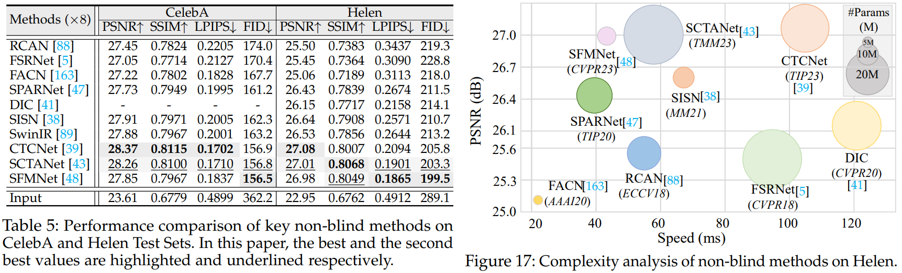
</p>

### Blind Face Restoration
<p align="center">
  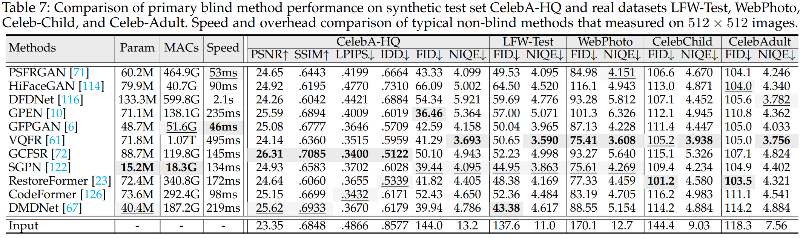
</p>

<p align="center">
  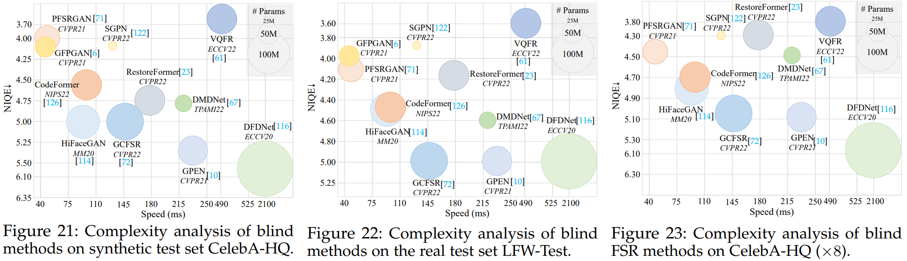
</p>

### Blind Face Super-Resoution
<p align="center">
  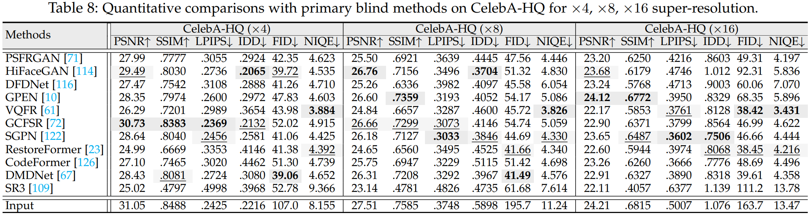
</p>

<p align="center">
  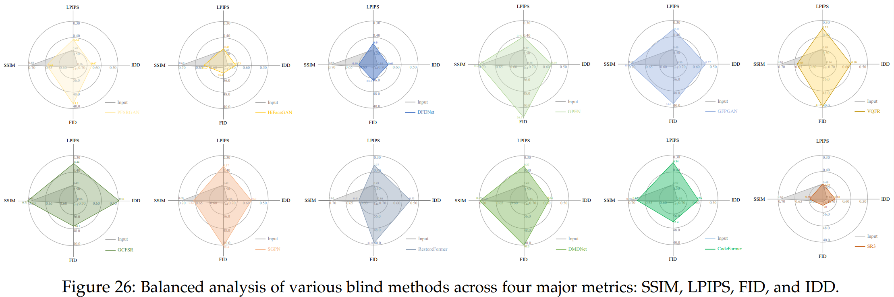
</p>

### Joint Face Restoration
:boom: **Note**: It can be found in the <a href="https://github.com/24wenjie-li/Awesome-Face-Restoration/blob/main/imgs/Supplementary.pdf">Supplementary Material</a>.

## Benchmarks
### Popular Datasets
|Dataset|Quantity|Introduction|Year|
|:----:|:----:|:----:|:----:|
|[FFHQ](https://github.com/NVlabs/ffhq-dataset)|70,000|non-paired dataset for training|2018|
|[CelebA](http://mmlab.ie.cuhk.edu.hk/projects/CelebA.html)|202,599|non-paired dataset for training|2015|
|[CelebA-HQ](https://paperswithcode.com/dataset/celeba-hq)|30,000|non-paired dataset for training|2020|
|[LFW](http://vis-www.cs.umass.edu/lfw/)|13,233|non-paired dataset for training|2008|
|[Multi-PIE](https://www.cs.cmu.edu/afs/cs/project/PIE/MultiPie/Multi-Pie/Home.html)|75,000|non-paired dataset for training|2010|
|[Helen](http://www.ifp.illinois.edu/~vuongle2/helen)|2,330|non-paired dataset for testing|2012|
|[CelebA-Test](https://xinntao.github.io/projects/gfpgan)|3,000|non-paired dataset for testing|2021|
|[CelebChild-Test](https://xinntao.github.io/projects/gfpgan)|180|non-paired real-world dataset for testing|2021|
|[CelebAdult-Test](https://xinntao.github.io/projects/gfpgan)|180|non-paired real-world dataset for testing|2021|
|[WebPhoto-Test](https://xinntao.github.io/projects/gfpgan)|407|non-paired real-world dataset for testing|2021|
|[LFW-Test](https://xinntao.github.io/projects/gfpgan)|1,711|non-paired real-world dataset for testing|2021|
|[Wider-Test](https://shangchenzhou.com/projects/CodeFormer/)|970|non-paired real-world dataset for testing|2022|

:boom: **Note**: More datasets can be found in the <a href="http://export.arxiv.org/pdf/2309.15490">Paper</a>.

### Evaluation Metrics
:triangular_flag_on_post: **Note**: A detailed description of the evaluation metrics and how to use it can be found <a href="https://github.com/chaofengc/Awesome-Image-Quality-Assessment">here</a>.


## :e-mail: Contact

If you have any question, please email `lewj2408@gmail.com`
