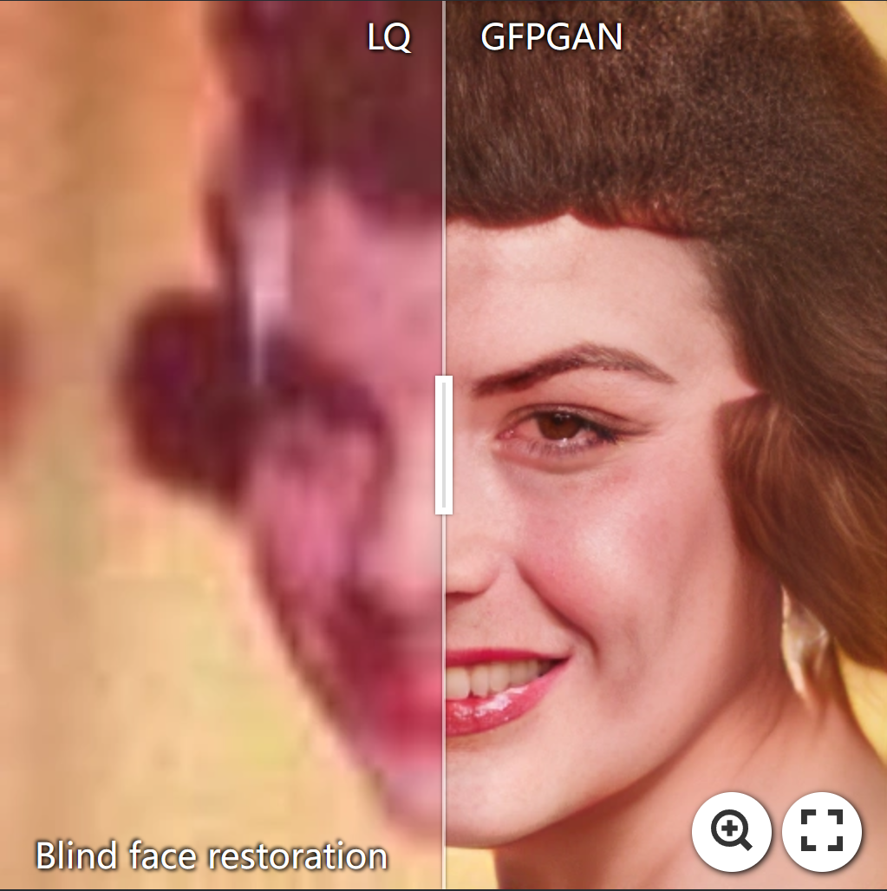

<!-- PROJECT LOGO -->
<p align="center">
  <h3 align="center">Survey on Deep Face Restoration: From Non-blind to Blind and Beyond </h3>
  <p align="center">A comprehensive statistic on methods related to deep face restoration.
    <br />
    <a href="http://export.arxiv.org/pdf/2309.15490">[Paper]</a> &emsp;
    <a href="https://github.com/24wenjie-li/Awesome-Face-Restoration/blob/main/imgs/Supplementary.pdf">[Supplementary Material]</a>
  </p>
</p>

<p align="center">
  
</p>

|[](https://imgsli.com/MjEwOTA4) | [](https://imgsli.com/MjEwOTA5) | [](https://imgsli.com/MjEwOTEz) | [](https://imgsli.com/MjEwOTEy) | [](https://imgsli.com/MjEwOTEw)

|[](https://imgsli.com/MjEwOTIx) | [](https://imgsli.com/MjEwOTE4) | [](https://imgsli.com/MjEwOTE3) | [](https://imgsli.com/MjEwOTE5) | [](https://imgsli.com/MjEwOTIw)

:boom: **Note**: More visual comparisons can be found in the <a href="http://export.arxiv.org/pdf/2309.15490">Paper</a> and <a href="https://github.com/24wenjie-li/Awesome-Face-Restoration/blob/main/imgs/Supplementary.pdf">Supplementary Material</a>.
  
---

## :clipboard: Citation

```
@article{li2023survey,
  title={Survey on Deep Face Restoration: From Non-blind to Blind and Beyond},
  author={Li, Wenjie and Wang, Mei and Zhang, Kai and Li, Juncheng and Li, Xiaoming and Zhang, Yuhang and Gao, Guangwei and Deng, Weihong and Lin, Chia-Wen},
  journal={arXiv preprint arXiv:2309.15490},
  year={2023}
}
```

## Table of contents
<!-- - [Survey paper](#survey-paper)
- [Table of contents](#table-of-contents) -->
- [Non-Blind Tasks](#non-blind-face-restoration)
- [Blind Tasks](#blind-face-restoration)
- [Joint Tasks](#joint-tasks)
  - [Joint Face Completion](#Joint-Face-Completion)
  - [Joint Face Frontalization](#Joint-Face-Frontalization)
  - [Joint Face Alignment](#Joint-Face-Alignment)
  - [Joint Face Recogntion](#Joint-Face-Recogntion)
  - [Joint Face Illumination Compensation](#Joint-Face-Illumination-Compensation)
  - [Joint Face Fairness](#Joint-Face-Fairness)
  - [Joint 3D Face Reconstruction](#Joint-3D-Face-Reconstruction)
- [Perfermance](#perfermance)
  - [Non-Bind Face Super-Resoution](#Non-blind-Face-Super-Resoution)
  - [Blind Face Restoration](#Blind-Face-Restoration)
  - [Blind Face Super-Resoution](#Blind-Face-Super-Resoution)
- [Benchmarks](#benchmarks)
  - [Datasets](#datasets)
  - [Losses](#loss)
 

## Non-Blind Tasks
|Pub<div style="width:60px">|Paper<div style="width:600px">|Technology<div style="width:100px">|
|:---:|:----:|:----:|
|AAAI-2015|<a href="https://ojs.aaai.org/index.php/AAAI/article/download/9795/9654">Learning Face Hallucination in the Wild|CNN-based|
|ECCV-2016|<a href="https://browse.arxiv.org/pdf/1607.05046v1.pdf">Deep cascaded bi-network for face hallucination|CNN-based|
|ECCV-2016|<a href="https://browse.arxiv.org/pdf/1707.00737.pdf">Ultra-resolving face images by discriminative generative networks|GAN-based|
|ICCV-2017|<a href="[https://openaccess.thecvf.com/content_ICCV_2017/papers/Huang_Wavelet-SRNet_A_Wavelet-Based_ICCV_2017_paper.pdf]">Wavelet-SRNet: A Wavelet-based CNN for Multi-scale Face Super Resolution|Wavelet transform|
|CVPR-2017|<a href="[https://arxiv.org/abs/1708.03132]">Attention-Aware Face Hallucination via Deep Reinforcement Learning|Attention-based|
|IJCAI-2017|<a href="[https://arxiv.org/pdf/1708.00223.pdf]">Learning to Hallucinate Face Images via Component Generation and Enhancement|Prior-based|
|ICASSP-2017|<a href="[https://ieeexplore.ieee.org/document/8462170]">Face Hallucination Based on Key Parts Enhancement|CNN-based|
|CVPR-2018|<a href="[https://openaccess.thecvf.com/content_cvpr_2018/papers/Chen_FSRNet_End-to-End_Learning_CVPR_2018_paper.pdf]">FSRNet: End-to-End Learning Face Super-Resolution with Facial Priors|Prior-based|
|CVPRW-2018|<a href="[https://arxiv.org/pdf/1811.02328.pdf]">Attribute Augmented Convolutional Neural Network for Face Hallucination|GAN-based|
|ECCV-2018|<a href="[https://arxiv.org/pdf/1811.02328.pdf]">Super-Identity Convolutional Neural Network for Face Hallucination|Prior-based|
|ECCV-2018|<a href="[https://openaccess.thecvf.com/content_ECCV_2018/papers/Xin_Yu_Face_Super-resolution_Guided_ECCV_2018_paper.pdf]">Face Super-resolution Guided by Facial Component Heatmaps|Prior-based|
|IJCAI-2018|<a href="[https://arxiv.org/pdf/1806.10726.pdf]">Deep CNN Denoiser and Multi-layer Neighbor Component Embedding for Face HallucinationDeep CNN Denoiser and Multi-layer Neighbor Component Embedding for Face Hallucination|CNN-based|


## Blind Tasks
|Pub<div style="width:60px">|Paper<div style="width:600px">|Technology<div style="width:100px">|
|:---:|:----:|:----:|
|ECCV18|<a href="https://openaccess.thecvf.com/content_ECCV_2018/papers/Xiaoming_Li_Learning_Warped_Guidance_ECCV_2018_paper.pdf">Learning Warped Guidance for Blind Face Restoration|CNN|

## :e-mail: Contact

If you have any question, please email `lewj2408@gmail.com`
