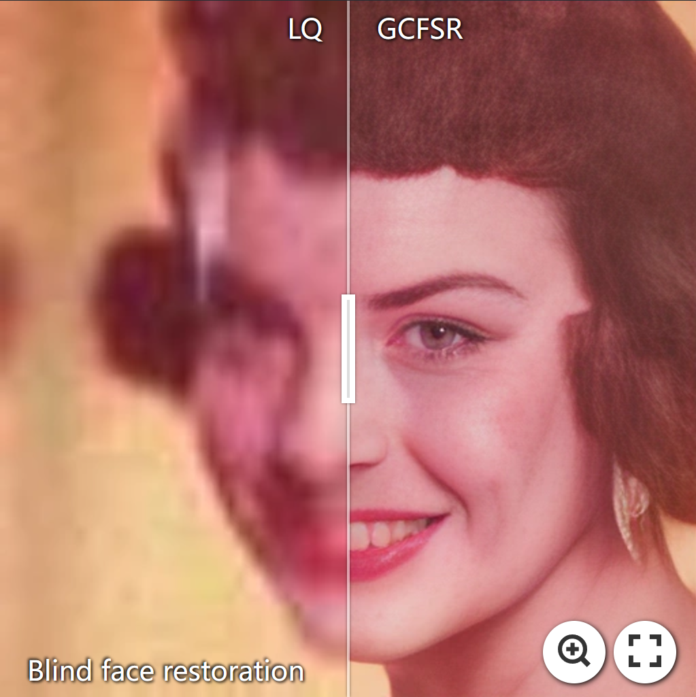

<!-- PROJECT LOGO -->

  <h3 align="center">Survey on Deep Face Restoration: From Non-blind to Blind and Beyond </h3>
  
A comprehensive statistic on methods related to deep face restoration.
     
    <a href="http://export.arxiv.org/pdf/2309.15490">[Paper]</a> &emsp;
    <a href="https://github.com/24wenjie-li/Awesome-Face-Restoration/blob/main/imgs/Supplementary.pdf">[Supplementary Material]</a>
  

|  |  |  |  |  | 

